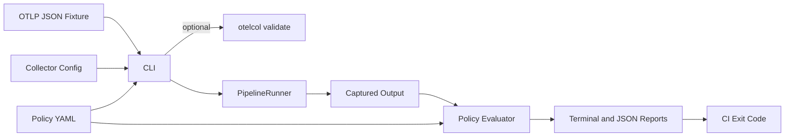

# Architecture

## Overview

`otel-policy-lab` is a CLI policy-testing harness that evaluates representative OpenTelemetry telemetry fixtures against governance policies. The default runner simulates only a documented subset of Collector behavior and reports that confidence boundary explicitly.



## Package responsibilities

| Package | Responsibility |
|---------|----------------|
| `cmd/otel-policy-lab` | Binary entrypoint |
| `internal/cli` | Command parsing and orchestration |
| `internal/policy` | Policy schema and YAML validation |
| `internal/telemetry` | OTLP JSON fixture parsing with Collector pdata and normalization |
| `internal/runner` | `PipelineRunner` abstraction and fixture-based simulation |
| `internal/evaluator` | Policy assertion evaluation |
| `internal/report` | Terminal and JSON report generation |
| `internal/collector` | Real `otelcol validate` shell-out |

## Data flow

1. CLI loads collector config, fixture, and policy.
2. Optional Collector validation runs `otelcol validate --config <path>`.
3. `PipelineRunner` produces input and output telemetry sets.
4. `Evaluator` compares output (and input for preservation checks) against policy assertions.
5. `Report` package renders human-readable and JSON output.
6. CLI exits with a non-zero code when policy checks fail.

## PipelineRunner boundary

`PipelineRunner` is the primary extension point:

```go
type PipelineRunner interface {
    Run(ctx context.Context, req RunRequest) (*RunResult, error)
}
```

MVP implements `FixtureRunner`, which:

- loads OTLP JSON fixtures through official Collector pdata unmarshalling
- applies a small subset of processor semantics inferred from collector config
- warns about unsupported or partially simulated processors
- returns deterministic output for policy evaluation

The normalized `telemetry.Set` keeps only the fields required by current policies: resource attributes, signal attributes, log bodies, span status and identity, metric names, and datapoint labels. This is intentionally smaller than Collector pdata and may need to expand when `RealCollectorRunner` lands.

Future `RealCollectorRunner` will:

- start or shell out to `otelcol`
- send fixture telemetry via OTLP
- capture exported telemetry from a file or debug exporter
- return real pipeline output for evaluation

## CI integration

The CLI is designed for CI usage:

- deterministic fixture input
- explicit policy file
- non-zero exit code on failure
- runner-coverage warnings in terminal and JSON output
- optional JSON report artifact
- optional real Collector config validation

Typical usage:

```sh
otel-policy-lab test \
  --collector-config collector.yaml \
  --input fixtures/checkout.otlp.json \
  --policy policy.yaml \
  --report report.json
```

Collector validation only:

```sh
otel-policy-lab validate --collector-config collector.yaml
```

## Extension points

- new `PipelineRunner` implementations (`otelcol`, remote runner)
- additional policy assertions (sampling, tail sampling, cost bounds)
- SARIF output format
- OTLP protobuf fixture support
