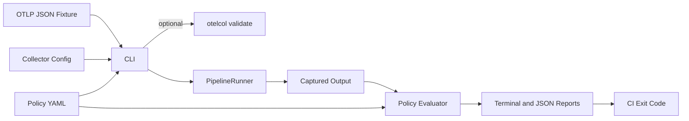
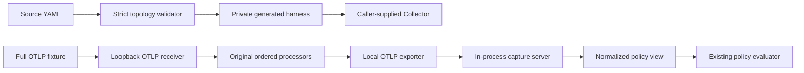

# Architecture

## Overview

`otel-policy-lab` is a CLI policy-testing harness that evaluates representative OpenTelemetry telemetry fixtures against governance policies. The default fixture runner simulates a documented subset of Collector behaviour. The explicitly selected real runner executes processor chains in a caller-supplied binary and captures local OTLP output.


```mermaid
flowchart LR
    fixture["OTLP JSON Fixture"] --> cli[CLI]
    collectorConfig["Collector Config"] --> cli
    policyFile["Policy YAML"] --> cli
    cli -->|"optional"| collectorValidate["otelcol validate"]
    cli --> runner["PipelineRunner"]
    runner --> outputTelemetry["Captured Output"]
    policyFile --> evaluator["Policy Evaluator"]
    outputTelemetry --> evaluator
    evaluator --> report["Terminal and JSON Reports"]
    report --> exitCode["CI Exit Code"]
```

## Package responsibilities

| Package | Responsibility |
|---------|----------------|
| `cmd/otel-policy-lab` | Binary entrypoint |
| `internal/cli` | Command parsing and orchestration |
| `internal/policy` | Policy schema and YAML validation |
| `internal/telemetry` | OTLP JSON fixture parsing with Collector pdata and normalization |
| `internal/runner` | `PipelineRunner` abstraction and fixture-based simulation |
| `internal/evaluator` | Policy assertion evaluation |
| `internal/report` | Terminal and JSON report generation |
| `internal/collector` | Real `otelcol validate` shell-out |

## Data flow

1. CLI loads collector config, fixture, and policy.
2. Optional Collector validation runs `otelcol validate --config <path>`.
3. `PipelineRunner` produces input and output telemetry sets.
4. `Evaluator` compares output (and input for preservation checks) against policy assertions.
5. `Report` package renders human-readable and JSON output.
6. CLI exits with a non-zero code when policy checks fail.

## PipelineRunner boundary

`PipelineRunner` is the primary extension point:

```go
type PipelineRunner interface {
    Run(ctx context.Context, req RunRequest) (*RunResult, error)
}
```

MVP implements `FixtureRunner`, which:

- loads OTLP JSON fixtures through official Collector pdata unmarshalling
- applies a small subset of processor semantics inferred from collector config
- warns about unsupported or partially simulated processors
- returns deterministic output for policy evaluation

The normalized `telemetry.Set` keeps only the fields required by current policies: resource attributes, signal attributes, log bodies, span status and identity, metric names, and datapoint labels. This is intentionally smaller than Collector pdata and may need to expand when `RealCollectorRunner` lands.

## Real execution boundary

The full OTLP pdata model is retained for transmission, including timestamps, severity, metric values/types and typed attributes. The smaller `telemetry.Set` remains the policy view. Captured fragments are normalized into stable record order before evaluation. Metric cardinality is aggregated across requests and resources by metric name.


```mermaid
flowchart LR
    source[Source YAML] --> topology[Strict topology validator]
    topology --> harness[Private generated harness]
    raw[Full OTLP fixture] --> receiver[Loopback OTLP receiver]
    harness --> process[Caller-supplied Collector]
    receiver --> processors[Original ordered processors]
    processors --> exporter[Local OTLP exporter]
    exporter --> capture[In-process capture server]
    capture --> normalized[Normalized policy view]
    normalized --> evaluator[Existing policy evaluator]
```

`internal/runner` owns YAML isolation, OTLP transport, bounded capture, diagnostics and subprocess lifecycle. It does not evaluate policy. The CLI supplies cancellation/timeouts, then converts runner failures to safe ERROR reports. Generic evaluator evidence options handle missing input and unreliable output without knowledge of runner names. The report layer keeps fixture schema 1 while real execution uses schema 2.

The Collector runs from the source configuration directory with the inherited environment, in its own Unix process group. Graceful shutdown precedes capture-server shutdown. Forced cleanup and private-file removal run on every path. Source receivers, exporters, extensions and service telemetry are omitted. This is configuration isolation of trusted code, not a network sandbox. See [the real-runner contract](real-collector-runner.md).

## CI integration

The CLI is designed for CI usage:

- deterministic fixture input
- explicit policy file
- non-zero exit code on failure
- runner-coverage warnings in terminal and JSON output
- optional JSON report artifact
- optional real Collector config validation

Typical usage:

```sh
otel-policy-lab test \
  --collector-config collector.yaml \
  --input fixtures/checkout.otlp.json \
  --policy policy.yaml \
  --report report.json
```

Collector validation only:

```sh
otel-policy-lab validate --collector-config collector.yaml
```

## Extension points

- additional `PipelineRunner` implementations (containers, remote runner)
- additional policy assertions (sampling, tail sampling, cost bounds)
- SARIF output format
- OTLP protobuf fixture support
